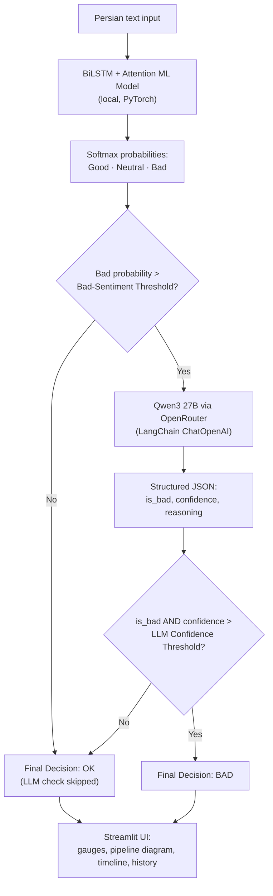
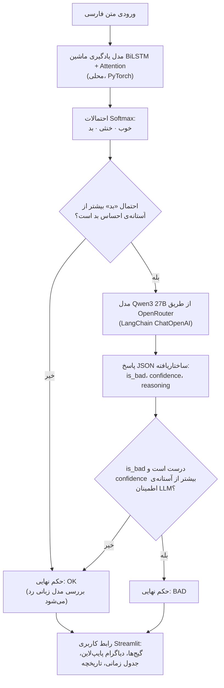

# Persian Sentiment Analysis Pipeline 

A Streamlit application that classifies Persian (Farsi) text as **Good**, **Neutral**, or **Bad** using a two-stage pipeline: a fast local **BiLSTM + attention** neural network for the first pass, escalating only the uncertain "bad-looking" cases to a **Qwen3 LLM via OpenRouter** (through LangChain) for a second, higher-confidence opinion.

---

## Overall Pipeline

Every piece of text goes through the same core flow. Cheap, local inference runs first; the expensive LLM call only fires when the local model is unsure enough to warrant a second opinion.



**Pipeline stages, in words:**
1. **Local ML classification** — the raw Persian text is tokenized/numericalized with a custom Persian vocabulary and run through a **BiLSTM with an attention layer** (loaded from `best_sentiment_model.pth`), which outputs class probabilities for *Good*, *Neutral*, and *Bad*.
2. **Threshold gate** — if the *Bad* probability is at or below the configurable **Bad Sentiment Threshold** (default 10%), the pipeline stops here and the text is marked **OK** — no LLM call is made, keeping the common case fast and free.
3. **LLM verification (only for likely-bad cases)** — when the *Bad* probability clears the threshold, the text is sent to **Qwen3 27B** through **OpenRouter**, via a LangChain prompt that asks for a structured `{is_bad, confidence, reasoning}` JSON verdict, primed with known Persian negative-sentiment cues.
4. **Final decision gate** — the text is only confirmed **BAD** if the LLM says `is_bad = true` **and** its confidence clears the configurable **LLM Confidence Threshold** (default 60%); otherwise the final decision falls back to **OK**, treating the LLM as a precision filter against the ML model's false positives.
5. **Visualization & logging** — every run renders a live animated pipeline diagram, per-class probability gauges, a step-duration timeline, and appends the result to an in-session analysis history.

---

##  How the App Works

1. **Enter your OpenRouter API key** in the sidebar (required only for the LLM verification step — get one at [openrouter.ai/keys](https://openrouter.ai/keys)).
2. **Adjust the two thresholds** if desired:
   - **Bad Sentiment Threshold** — how high the ML model's "bad" probability must be before the LLM is even consulted.
   - **LLM Confidence Threshold** — how confident Qwen3 must be before its "bad" verdict is trusted.
3. **Type or paste Persian text** in the input box, or click one of the three example buttons (Good / Neutral / Bad) to try a sample sentence instantly.
4. Click **"🔍 Analyse Sentiment"**. A live pipeline diagram animates as each stage runs (Start → ML Model → Threshold Check → Qwen3 Check *(if triggered)* → Final Decision).
5. **Review the results**:
   - Four metric cards: the ML model's raw prediction, its *bad* probability, Qwen3's confidence (or "Skipped" if the LLM wasn't called), and the color-coded final decision (✅ OK / ⚠️ BAD).
   - A **Probabilities** tab with a three-gauge chart and a threshold-check table.
   - A **Qwen3 Details** tab with the raw JSON response and a human-readable interpretation of the LLM's reasoning (only populated when the LLM ran).
   - A **Timeline** tab showing how long each pipeline stage took.
   - An expandable **Analysis History** panel listing the last 10 analyses run in the session.

---

##  Features

-  **Two-stage cascade classification** — combines a lightweight local neural network with an LLM sanity-check, avoiding an LLM call for the vast majority of inputs.
-  **Dynamic architecture inference** — the BiLSTM's embedding size, hidden size, output size, and layer count are inferred directly from the checkpoint's saved weights, so the app can load compatible checkpoints without hardcoding architecture parameters.
- 🇮🇷 **Persian-aware tokenization** — a custom vocabulary and regex-based tokenizer strip non-Persian characters while preserving essential punctuation, with `<SOS>`/`<EOS>`/`<PAD>`/`<UNK>` handling and fixed-length numericalization.
-  **Fully adjustable thresholds** — both the ML "bad" trigger threshold and the LLM confidence bar are live sliders, letting you tune sensitivity without touching code.
-  **Rich, animated visualizations** — a live Plotly pipeline-flow diagram that highlights the active path for each analysis, per-class probability gauges with a threshold marker, and a processing-time timeline bar chart.
-  **In-session history tracking** — every analysis is logged with its text, ML suggestion, bad probability, and final decision, plus running "total analysed" / "bad rate" statistics in the sidebar.
-  **Graceful fallback** — if `best_sentiment_model.pth` is missing or incompatible, the app reports the checkpoint's keys and offers a one-click placeholder model so the UI never fully breaks.
-  **LangChain + OpenRouter integration** — the LLM stage is built as a LangChain chain (`prompt | llm | parser`) so the model, endpoint, or prompt can be swapped without touching the surrounding pipeline logic.

---

## Requirements

- Python 3.10+
- An [OpenRouter](https://openrouter.ai/keys) API key (only needed to trigger the Qwen3 verification stage; the ML-only path works without it, though the "Analyse" button stays disabled until a key is entered)
- The trained checkpoint file `best_sentiment_model.pth` (must include a `model_state_dict` and, ideally, a `vocab_word2idx` key) in the app's working directory
- Key dependencies (add these to `requirements.txt`):
  - `streamlit`
  - `torch`
  - `pandas`
  - `plotly`
  - `langchain-openai`, `langchain-core`
  - `langchain` *(for `ResponseSchema` / `StructuredOutputParser` used by the LLM output parser — see the note below)*


---

##  Installation & Usage

```bash
# 1. Clone the repository
git clone <your-repo-url>
cd <your-repo-folder>

# 2. Create and activate a virtual environment (recommended)
python -m venv venv
source venv/bin/activate      # On Windows: venv\Scripts\activate

# 3. Install dependencies
pip install -r requirements.txt

# 4. Make sure the trained checkpoint is present
#    best_sentiment_model.pth must be in the project root

# 5. Run the app
streamlit run app.py
```

The app will open in your browser at `http://localhost:8501`. Enter your OpenRouter API key in the sidebar to enable the LLM verification stage.

### Configuration reference (sidebar)

| Setting | Default | Description |
|---|---|---|
| OpenRouter API Key | *(empty)* | Required to run the Qwen3 verification step. |
| Bad Sentiment Threshold | `0.10` | Minimum ML "bad" probability that triggers the LLM check. |
| LLM Confidence Threshold | `0.60` | Minimum Qwen3 confidence required to confirm a final **BAD** decision. |
| Model | `qwen/qwen3.6-27b` (fixed in code) | The OpenRouter model used for verification; change `MODEL_NAME` in `app.py` to use a different model. |

---

##  Project Structure

```
.
├── app.py                        # Streamlit app: model loading, pipeline, LLM chain, UI, visualizations
├── best_sentiment_model.pth      # Trained BiLSTM checkpoint (weights + vocabulary + config)
├── requirements.txt              # Python dependencies
└── README.md
```

---


---

# پایپ‌لاین تحلیل احساسات متن فارسی

یک اپلیکیشن Streamlit که متن فارسی را با استفاده از یک پایپ‌لاین دو مرحله‌ای به سه دسته‌ی **خوب (Good)**، **خنثی (Neutral)** یا **بد (Bad)** طبقه‌بندی می‌کند: ابتدا یک شبکه‌ی عصبی محلی و سریع از نوع **BiLSTM همراه با مکانیزم توجه (Attention)** بررسی اولیه را انجام می‌دهد، و فقط مواردی که به‌طور مشکوک «بد» تشخیص داده شوند برای گرفتن نظر دوم و با اطمینان بالاتر، به مدل زبانی **Qwen3 از طریق OpenRouter** ارسال می‌شوند.

---

##  نمای کلی پایپ‌لاین

هر متن ورودی از یک مسیر یکسان عبور می‌کند. ابتدا استنتاج محلی و ارزان اجرا می‌شود؛ فراخوانی پرهزینه‌ی مدل زبانی فقط زمانی فعال می‌شود که مدل محلی به‌اندازه‌ی کافی نامطمئن باشد که نیاز به نظر دوم داشته باشد.



**مراحل پایپ‌لاین به‌صورت متنی:**
۱. **طبقه‌بندی محلی با یادگیری ماشین** — متن خام فارسی با استفاده از یک واژگان اختصاصی فارسی توکنایز/عددی‌سازی شده و از میان یک شبکه‌ی **BiLSTM با لایه‌ی توجه** (بارگذاری‌شده از فایل `best_sentiment_model.pth`) عبور می‌کند که احتمالات هر کلاس (*خوب*، *خنثی*، *بد*) را خروجی می‌دهد.

۲. **دروازه‌ی آستانه** — اگر احتمال کلاس «بد» مساوی یا کمتر از **آستانه‌ی احساس بد** قابل‌تنظیم (پیش‌فرض ۱۰٪) باشد، پایپ‌لاین در همین‌جا متوقف شده و متن **OK** علامت‌گذاری می‌شود — هیچ فراخوانی مدل زبانی انجام نمی‌شود، که باعث سریع و رایگان ماندن حالت رایج می‌شود.

۳. **بررسی توسط مدل زبانی (فقط برای موارد احتمالاً بد)** — وقتی احتمال «بد» از آستانه عبور کند، متن از طریق **OpenRouter** به مدل **Qwen3 27B** ارسال می‌شود؛ این کار با یک پرامپت LangChain انجام می‌شود که یک پاسخ JSON ساختاریافته شامل `{is_bad, confidence, reasoning}` درخواست می‌کند و با نشانه‌های شناخته‌شده‌ی احساس منفی در فارسی راهنمایی شده است.

۴. **دروازه‌ی تصمیم نهایی** — متن فقط زمانی به‌عنوان **BAD** تأیید نهایی می‌شود که مدل زبانی مقدار `is_bad = true` را برگرداند **و** میزان اطمینان آن از **آستانه‌ی اطمینان مدل زبانی** قابل‌تنظیم (پیش‌فرض ۶۰٪) عبور کند؛ در غیر این صورت تصمیم نهایی به **OK** بازمی‌گردد، به این ترتیب مدل زبانی به‌عنوان یک فیلتر دقت در برابر تشخیص‌های مثبت کاذب مدل یادگیری ماشین عمل می‌کند.

۵. **نمایش تصویری و ثبت لاگ** — در هر اجرا، یک دیاگرام پایپ‌لاین متحرک زنده، گیج‌های احتمال هر کلاس، یک جدول زمانی مدت هر مرحله رسم شده و نتیجه به تاریخچه‌ی تحلیل در همان نشست (session) اضافه می‌شود.

---

## نحوه‌ی کارکرد اپلیکیشن

۱. **کلید API خود از OpenRouter را در نوار کناری وارد کنید** (فقط برای مرحله‌ی بررسی با مدل زبانی لازم است — کلید را از [openrouter.ai/keys](https://openrouter.ai/keys) دریافت کنید).

۲. **دو آستانه را در صورت تمایل تنظیم کنید:**
   - **آستانه‌ی احساس بد (Bad Sentiment Threshold)** — احتمال «بد» مدل یادگیری ماشین باید چقدر بالا باشد تا اصلاً مدل زبانی مشورت شود.
   - **آستانه‌ی اطمینان مدل زبانی (LLM Confidence Threshold)** — Qwen3 باید چقدر مطمئن باشد تا حکم «بد» آن قابل‌اعتماد تلقی شود.

۳. **متن فارسی را تایپ یا paste کنید**، یا روی یکی از سه دکمه‌ی نمونه (خوب / خنثی / بد) کلیک کنید تا بلافاصله یک جمله‌ی نمونه امتحان شود.

۴. روی **«🔍 Analyse Sentiment»** کلیک کنید. یک دیاگرام پایپ‌لاین زنده هنگام اجرای هر مرحله متحرک می‌شود (شروع ← مدل یادگیری ماشین ← بررسی آستانه ← بررسی Qwen3 *(در صورت فعال شدن)* ← تصمیم نهایی).

۵. **نتایج را بررسی کنید:**
   - چهار کارت متریک: پیش‌بینی خام مدل یادگیری ماشین، احتمال «بد» آن، اطمینان Qwen3 (یا «Skipped» در صورت عدم فراخوانی مدل زبانی)، و تصمیم نهایی رنگی (✅ OK / ⚠️ BAD).
   - یک تب **Probabilities** با نمودار سه‌گیجی و جدول بررسی آستانه.
   - یک تب **Qwen3 Details** با پاسخ خام JSON و تفسیر قابل‌فهم از استدلال مدل زبانی (فقط زمانی پر می‌شود که مدل زبانی اجرا شده باشد).
   - یک تب **Timeline** که مدت زمان هر مرحله از پایپ‌لاین را نشان می‌دهد.
   - یک پنل قابل‌بازشدن **Analysis History** که ۱۰ تحلیل آخر اجراشده در همان نشست را فهرست می‌کند.

---

## ویژگی‌ها

- **طبقه‌بندی آبشاری دو مرحله‌ای** — ترکیب یک شبکه‌ی عصبی سبک و محلی با یک بررسی صحت توسط مدل زبانی، که از فراخوانی مدل زبانی برای اکثریت قریب‌به‌اتفاق ورودی‌ها جلوگیری می‌کند.
- **استنتاج پویا از معماری مدل** — اندازه‌ی embedding، اندازه‌ی hidden، اندازه‌ی خروجی و تعداد لایه‌های BiLSTM مستقیماً از وزن‌های ذخیره‌شده در چک‌پوینت استنتاج می‌شوند، به این ترتیب اپلیکیشن می‌تواند چک‌پوینت‌های سازگار را بدون هاردکد کردن پارامترهای معماری بارگذاری کند.
- 🇮🇷 **توکنایز کردن آگاه از زبان فارسی** — یک واژگان اختصاصی و توکنایزر مبتنی بر regex، کاراکترهای غیرفارسی را حذف می‌کند و در عین حال علائم نگارشی ضروری را حفظ کرده، همراه با مدیریت `<SOS>`/`<EOS>`/`<PAD>`/`<UNK>` و عددی‌سازی با طول ثابت.
- **آستانه‌های کاملاً قابل تنظیم** — هم آستانه‌ی محرک «بد» در مدل یادگیری ماشین و هم نوار اطمینان مدل زبانی، اسلایدرهای زنده هستند که امکان تنظیم حساسیت بدون تغییر کد را می‌دهند.
- **نمایش‌های تصویری غنی و متحرک** — یک دیاگرام زنده‌ی جریان پایپ‌لاین با Plotly که مسیر فعال هر تحلیل را برجسته می‌کند، گیج‌های احتمال هر کلاس همراه با نشانگر آستانه، و یک نمودار میله‌ای زمانی از مدت پردازش.
- **ردیابی تاریخچه در همان نشست** — هر تحلیل به همراه متن، پیشنهاد مدل یادگیری ماشین، احتمال «بد» و تصمیم نهایی ثبت می‌شود، به‌همراه آمار زنده‌ی «تعداد کل تحلیل‌شده» / «نرخ بد» در نوار کناری.
- **بازگشت مطمئن در صورت خطا** — اگر فایل `best_sentiment_model.pth` وجود نداشته باشد یا ناسازگار باشد، اپلیکیشن کلیدهای موجود در چک‌پوینت را گزارش کرده و یک مدل جایگزین با یک کلیک ارائه می‌دهد تا رابط کاربری هرگز به‌طور کامل از کار نیفتد.
- **یکپارچگی با LangChain و OpenRouter** — مرحله‌ی مدل زبانی به‌صورت یک زنجیره‌ی LangChain (`prompt | llm | parser`) ساخته شده است، به این ترتیب مدل، نقطه پایانی، یا پرامپت می‌تواند بدون تغییر منطق اطراف پایپ‌لاین جایگزین شود.

---

## نیازمندی‌ها

- پایتون ۳.۱۰ یا بالاتر
- یک کلید API از سرویس [OpenRouter](https://openrouter.ai/keys) (فقط برای فعال‌سازی مرحله‌ی بررسی با Qwen3 لازم است؛ مسیر فقط-یادگیری‌ماشین بدون آن هم کار می‌کند، هرچند دکمه‌ی «Analyse» تا زمان وارد کردن کلید غیرفعال باقی می‌ماند)
- فایل چک‌پوینت آموزش‌دیده `best_sentiment_model.pth` (باید شامل کلید `model_state_dict` و ترجیحاً کلید `vocab_word2idx` باشد) در پوشه‌ی کاری اپلیکیشن
- وابستگی‌های کلیدی (این‌ها را به `requirements.txt` اضافه کنید):
  - `streamlit`
  - `torch`
  - `pandas`
  - `plotly`
  - `langchain-openai`, `langchain-core`
  - `langchain` *(برای `ResponseSchema` / `StructuredOutputParser` که در پارسر خروجی مدل زبانی استفاده می‌شوند — به نکته‌ی زیر مراجعه کنید)*


---

## نصب و اجرا

```bash
# ۱. کلون کردن مخزن
git clone <your-repo-url>
cd <your-repo-folder>

# ۲. ساخت و فعال‌سازی محیط مجازی (پیشنهادی)
python -m venv venv
source venv/bin/activate      # در ویندوز: venv\Scripts\activate

# ۳. نصب وابستگی‌ها
pip install -r requirements.txt

# ۴. اطمینان از وجود چک‌پوینت آموزش‌دیده
#    فایل best_sentiment_model.pth باید در ریشه‌ی پروژه باشد

# ۵. اجرای برنامه
streamlit run app.py
```

اپلیکیشن در مرورگر شما و در آدرس `http://localhost:8501` باز خواهد شد. کلید API خود از OpenRouter را در نوار کناری وارد کنید تا مرحله‌ی بررسی با مدل زبانی فعال شود.

### مرجع تنظیمات (نوار کناری)

| تنظیم | پیش‌فرض | توضیح |
|---|---|---|
| کلید API از OpenRouter | *(خالی)* | برای اجرای مرحله‌ی بررسی با Qwen3 لازم است. |
| آستانه‌ی احساس بد | `0.10` | حداقل احتمال «بد» مدل یادگیری ماشین که مرحله‌ی بررسی با مدل زبانی را فعال می‌کند. |
| آستانه‌ی اطمینان مدل زبانی | `0.60` | حداقل اطمینان Qwen3 که برای تأیید نهایی تصمیم **BAD** لازم است. |
| مدل | `qwen/qwen3.6-27b` (در کد ثابت شده) | مدل OpenRouter مورد استفاده برای بررسی؛ برای استفاده از مدل دیگر، متغیر `MODEL_NAME` را در `app.py` تغییر دهید. |

---

## ساختار پروژه

```
.
├── app.py                        # اپلیکیشن Streamlit: بارگذاری مدل، پایپ‌لاین، زنجیره‌ی مدل زبانی، رابط کاربری، نمایش‌های تصویری
├── best_sentiment_model.pth      # چک‌پوینت آموزش‌دیده‌ی BiLSTM (وزن‌ها + واژگان + تنظیمات)
├── requirements.txt              # وابستگی‌های پایتون
└── README.md
```

---


